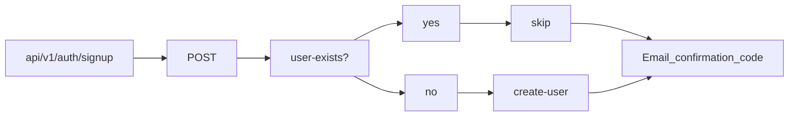
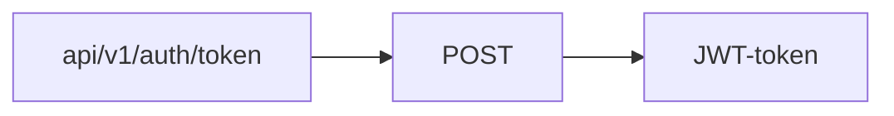

# api_yamdb

[](https://python.org)
[](https://www.djangoproject.com/)
[](https://www.django-rest-framework.org/)

[](https://github.com/kluevEVGA/api_final_yatube/blob/master/LICENSE)

## О ПРОЕКТЕ

Проект реализует REST API backend сервис на базе встроенной в Python sqlite базы данных и DjangoResetFramework. В
проекте подключена авторизация по JWT токенам.

### Команда разработки:

<a href='https://github.com/Siktorovich' title='Артём'>

</a>
<a href="https://github.com/lesinn1k" title='Никита'>

</a>
<a href='https://github.com/kluevEVGA' title='Евгений'>

</a>

## ЗАПУСК ПРОЕКТА

<hr/>
<details close>
<summary><h4 style="display: inline">WINDOWS <h3 style="display: inline">▶️</h3></h4></summary>

_Клонировать проект_

```shell
git clone https://github.com/kluevEVGA/api_yamdb.git
```

_Установить локальное окружение_

```shell
python -m venv venv
```

_Активировать окружение_

```shell
venv\Scripts\activate           # PowerShell
```

```shell
source venv/Scripts/activate    # Git Bash(Bash)
```

_Установить зависимости_

```shell
pip install -r requirements.txt
```

_Перейти в папку с проектом_

```shell
cd .\api_yamdb\
```

_Выполнить миграции_

```shell
python3 manage.py migrate
```

_запустить сервер_

```shell
python3 manage.py runserver
```

</details>
<hr/>

<details open>
<summary><h4 style="display: inline">LINUX & MacOS<h3 style="display: inline">▶️</h3></h4></summary>

_Клонировать проект_

```shell
git clone https://github.com/kluevEVGA/api_yamdb.git
```

_Установить локальное окружение_

```shell
python3 -m venv venv
```

_Активировать окружение_

```shell
source venv/bin/activate
```

_Установить зависимости_

```shell
pip install -r requirements.txt
```

_Перейти в папку с проектом_

```shell
cd .\api_yamdb\
```

_Выполнить миграции_

```shell
python3 manage.py migrate
```

_запустить сервер_

```shell
python3 manage.py runserver
```

</details>
<hr/>

## БАЗА ДАННЫХ

База данных построена на основе SQLITE.  
[Схема](https://dbdocs.io/kluev.evga/api_aymdb?view=relationships) базы данных создана при
помощи [DBML](https://www.dbml.org/docs/#project-definition) синтаксиса и приложения [dbdocs](https://dbdocs.io/).  
Файл схеммы [graph-db.dbml](https://github.com/kluevEVGA/api_yamdb/blob/master/graph-db.dbml).

[Установка](https://dbdocs.io/docs) и запуск приложения dbdocs:

```shell
npm install -g dbdocs
```

```shell
dbdocs login
```

выбрать метод аутентификации Email, указать свой email, скопировать код из email и вставить в консоль

```shell
dbdocs build graph-db.dbml
```

Последний шаг выведет в консоль ссылку на задеплоенный проект.

## Регистрация и авторизация



```json
{
  "email": "user@example.com",
  "username": "john_doe"
}
```

JWT



```json
{
  "username": "john_doe",
  "confirmation_code": "blyxv3-48b382b52eb0d5885cd281ca10a85839"
}
```

## ЛИЦЕНЗИЯ

Распространяется по `MIT` лицензии. Для дополнительной информации
смотри: [LICENSE](https://github.com/kluevEVGA/api_yamdb/blob/master/LICENSE)
